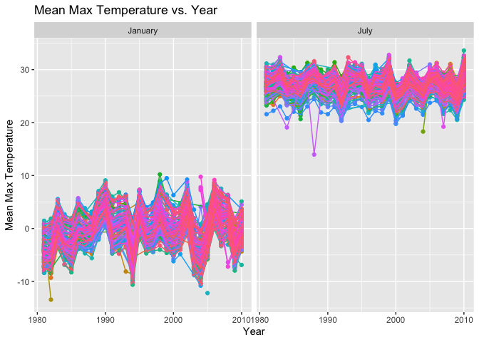

p8105_homework 3
================
2022-10-08

## Problem 2

#### Loading and Cleaning Data

``` r
accel_df = read_csv("./data/accel_data.csv") %>% janitor::clean_names() %>% pivot_longer(-c(week, day_id, day), names_to = "minute", values_to = "activity_counts") %>% mutate(minute = as.integer(gsub('[activity_]', '', minute))) %>% mutate(weekday_v_weekend = ifelse(day == "Saturday" | day == "Sunday", "Weekend", "Weekday")) %>% mutate(day = factor(day, levels = c("Sunday", "Monday", "Tuesday", "Wednesday", "Thursday", "Friday", "Saturday")), weekday_v_weekend = as.factor(weekday_v_weekend))
```

In order to clean the data, we first cleaned the named using
`janitor::clean_names()`. We then used `pivot_longer` to tidy the data
and create a row for each observation (each minute was given an entry in
the newly created `minute` variable). The corresponding activity count
values were added to the `activity_counts` variable. We then removed the
“activity\_” prefix in the `minute` variable to have a integer variable
that only contained the numeric values of the minutes. A
`weekday_v_weekend` variable was created to distinguish between the
types of days. The `day` variable was coerced into a factor variable
based on the days of the week, starting with Sunday. The resulting
dataset contains 50400 observations (one minute for each of the 35
days). The dataset contains the following variables: `week` to represent
the week number, `day_id` to represent the day number (ranging from 1 to
35), `day` variable to represent the day of the week, `minute` to
represent which minute of the day, `activity_counts` to represent the
activity at that specific minute, and `weekday_v_weekend` to represent
the type of day. The mean activity count per minute was 267.044.

#### Total Activity Over the Days

We will now aggregate across minutes and create a table showing the
total activity per day.

``` r
total_activity_df = accel_df %>%
  group_by(day_id, day) %>%
  summarize(total_activity = sum(activity_counts))

total_activity_df %>%
  knitr::kable(digits = 2)
```

| day_id | day       | total_activity |
|-------:|:----------|---------------:|
|      1 | Friday    |      480542.62 |
|      2 | Monday    |       78828.07 |
|      3 | Saturday  |      376254.00 |
|      4 | Sunday    |      631105.00 |
|      5 | Thursday  |      355923.64 |
|      6 | Tuesday   |      307094.24 |
|      7 | Wednesday |      340115.01 |
|      8 | Friday    |      568839.00 |
|      9 | Monday    |      295431.00 |
|     10 | Saturday  |      607175.00 |
|     11 | Sunday    |      422018.00 |
|     12 | Thursday  |      474048.00 |
|     13 | Tuesday   |      423245.00 |
|     14 | Wednesday |      440962.00 |
|     15 | Friday    |      467420.00 |
|     16 | Monday    |      685910.00 |
|     17 | Saturday  |      382928.00 |
|     18 | Sunday    |      467052.00 |
|     19 | Thursday  |      371230.00 |
|     20 | Tuesday   |      381507.00 |
|     21 | Wednesday |      468869.00 |
|     22 | Friday    |      154049.00 |
|     23 | Monday    |      409450.00 |
|     24 | Saturday  |        1440.00 |
|     25 | Sunday    |      260617.00 |
|     26 | Thursday  |      340291.00 |
|     27 | Tuesday   |      319568.00 |
|     28 | Wednesday |      434460.00 |
|     29 | Friday    |      620860.00 |
|     30 | Monday    |      389080.00 |
|     31 | Saturday  |        1440.00 |
|     32 | Sunday    |      138421.00 |
|     33 | Thursday  |      549658.00 |
|     34 | Tuesday   |      367824.00 |
|     35 | Wednesday |      445366.00 |

It can be noted that, according to the table, the man’s activity levels
were the lowest on the fourth and fifth Saturdays. On these days, his
activity count were valued at 1440. These values were much lower than
the mean activity level per day, which was approximately 384543. In
order to study the patterns of activity level each day more effectively,
we will create a scatterplot using `day_id` as our x-axis and
`total_activity` as our y-axis. We will use `geom_smooth` to estimate a
conditional mean to study how the the activity level changes across the
5 weeks.

``` r
ggplot(total_activity_df, aes(x = day_id, y = total_activity)) + 
  geom_point(aes(color = day)) +
  geom_smooth(se = FALSE) +  labs(
    title = "Total Activity Plot",
    x = "Day ID",
    y = "Total Activity Per Day",
  )
```

<!-- -->
Viewing the plot, it is apparent that the individual was gradually
increasing his activity levels until the second week, after which his
activity levels decreased. This continued until around the fourth week
when his activity levels began to increase again. The plot also confirms
that the individual had his lowest activity levels on the fourth and
fifth Saturdays.

#### Activity Over the Course of the Day

``` r
accel_hour_df = accel_df %>% 
  mutate(hour = floor(minute/60)) %>% 
  group_by(hour, day, day_id) %>% 
  summarize(hourly_total = sum(activity_counts)) %>% arrange(day_id)

ggplot(accel_hour_df, aes(x = hour, y = hourly_total)) + 
  geom_point(aes(color = day)) +
  geom_smooth(se = FALSE) +  labs(
    title = "Activity Over the Course of the Day",
    x = "Hour (military time)",
    y = "Activity")
```

<!-- -->

\#FIX THIS Overall, it appears that the individual…

## Problem 3

``` r
library(p8105.datasets)
data("ny_noaa")

sum(is.na(ny_noaa$date))
```

    ## [1] 0

The data contains 2595176 observations. The dataset contains variables
such as `id`, `date`, `prcp` to represent the precipitation, `snow` to
represent the snowfall, `snwd` to represent the snow depth, `tmax` to
represent the maximum temperature, and `tmin` to represent the minimum
temperature. The dataset contains observations from 747 distinct
stations. There are 3387623 missing values in the dataset. 0 of these
are from the `id` variable and 0 of these are from the `date` variable.
From the remaining 5 variables, there should be 12975880 cells with data
if the dataset were fully filled. However, from the 5 key variables with
measurements, 26.11% of the cells contain missing values. This could
post a significant issue, as over a quarter of the data from the 5 key
variables is missing measurements. However, due to the large size of the
dataset, there are still many observations that can be used in the
analysis.

``` r
ny_noaa_df = ny_noaa %>% separate(col = date, into = c("year", "month", "day")) %>% mutate(year = as.integer(year), month = as.integer(month), day = as.integer(day)) %>% mutate(prcp = prcp/10, tmax = as.numeric(tmax)/10, tmin = as.numeric(tmin)/10)

snow_counts_df = ny_noaa_df %>% group_by(snow) %>% select(snow) %>% summarize(count = n()) %>% arrange(-count)
```

In order to clean the data, separate variables for `year`, `month`, an
`day` were created. These variables were then coerced to integer types.
The `prcp` variable was mutated to be measured in mm, in order to be
consistent with the other measurement units of the other variables. The
`tmax` and `tmin` variables were mutated to be measured in degrees C.
The most frequent value of snowfall was 0 mm. The second most frequent
value was NA mm. This is likely due to the fact that many days without
snow were recorded.

#### Average Max Temperature in January and July in Each Station Across Years

``` r
ny_noaa_df_jan_jul = ny_noaa_df %>% filter(month == 1 | month == 7) %>% group_by(id, month, year) %>% drop_na(tmax) %>% summarize(mean_tmax = mean(tmax, na.rm = FALSE))

ggplot(ny_noaa_df_jan_jul, aes(x = year, y = (mean_tmax))) + 
  geom_point(alpha = .5) +
  geom_smooth(se = FALSE) + 
  facet_grid(. ~month)
```

<!-- -->

``` r
tmax_v_tmin = ggplot(ny_noaa_df, aes(x = tmin, y = tmax)) + 
  geom_hex()

noaa_density = ny_noaa_df %>% 
  filter(snow > 0 & snow < 100) %>% 
  group_by(year) %>%
  ggplot(aes(x = snow, fill = year, group = year)) + 
  geom_density(alpha = .1, adjust = .5) +
  scale_fill_viridis()

tmax_v_tmin + noaa_density
```

    ## Warning: Removed 1136276 rows containing non-finite values (stat_binhex).

<!-- -->
