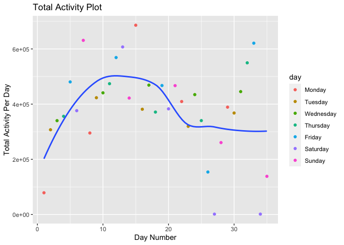

p8105_homework 3
================
2022-10-08

## Problem 2

#### Loading and Cleaning Data

``` r
accel_df = read_csv("./data/accel_data.csv") %>% 
  janitor::clean_names() %>% 
  pivot_longer(
    -c(week, day_id, day), names_to = "minute", values_to = "activity_counts") %>% 
  mutate(minute = as.double(gsub('[activity_]', '', minute))) %>%
  mutate(
    weekday_v_weekend = ifelse(
      day == "Saturday" | day == "Sunday", "Weekend", "Weekday")) %>% 
  mutate(
    day = factor(day, levels = c(
      "Monday", "Tuesday", "Wednesday", "Thursday", "Friday", "Saturday", "Sunday"
      )), weekday_v_weekend = as.factor(weekday_v_weekend)) %>%
  arrange(week, day) %>% 
  group_by(week, day) %>% 
  mutate(day_number = as.numeric(cur_group_id()))
```

In order to clean the data, the variable names were cleaned using
`janitor::clean_names()`. The function `pivot_longer()` was used to tidy
the data and create a row for each observation (each minute was given an
entry in the newly created `minute` variable). The corresponding
activity count values were added to the `activity_counts` variable. The
“activity\_” prefix in the `minute` variable were removed to have a
variable of type double that only contained the numeric values of the
minutes. A `weekday_v_weekend` variable was created to distinguish
between the types of days. The `day` variable was coerced into a factor
variable based on the days of the week, starting with Monday. The
dataset was then arranged by `week` and `day` order, meaning the first
day would be the Monday in week 1 which is followed by the Tuesday in
week 1 (this was done as the original dataset did not have the days
ordered correctly within each week). A new variable called `day_number`
was created to list and number the days in sequential order. The
resulting dataset contains 50400 observations (one minute for each of
the 35 days). The dataset contains the following variables: `week` to
represent the week number, `day_id` to represent the day number (ranging
from 1 to 35), `day` variable to represent the day of the week, `minute`
to represent which minute of the day, `activity_counts` to represent the
activity at that specific minute, and `weekday_v_weekend` to represent
the type of day. The mean activity count per minute was 267.044.

#### Total Activity Over the Days

We will now aggregate across minutes and create a table showing the
total activity per day.

``` r
total_activity_tidy_df = accel_df %>%
  group_by(day_number, week, day) %>%
  summarize(total_activity = sum(activity_counts))

total_activity_untidy_df = total_activity_tidy_df %>% 
  pivot_wider(-day_number, names_from = day, values_from = total_activity) %>%
  mutate(weekly_total = sum(
    c(Monday, Tuesday, Wednesday, Thursday, Friday, Saturday, Sunday
      )), weekly_mean = mean(
      c(Monday, Tuesday, Wednesday, Thursday, Friday, Saturday, Sunday)))

total_activity_untidy_df %>%
  knitr::kable(digits = 2)
```

| week |    Monday |  Tuesday | Wednesday | Thursday |   Friday | Saturday | Sunday | weekly_total | weekly_mean |
|-----:|----------:|---------:|----------:|---------:|---------:|---------:|-------:|-------------:|------------:|
|    1 |  78828.07 | 307094.2 |    340115 | 355923.6 | 480542.6 |   376254 | 631105 |      2569863 |    367123.2 |
|    2 | 295431.00 | 423245.0 |    440962 | 474048.0 | 568839.0 |   607175 | 422018 |      3231718 |    461674.0 |
|    3 | 685910.00 | 381507.0 |    468869 | 371230.0 | 467420.0 |   382928 | 467052 |      3224916 |    460702.3 |
|    4 | 409450.00 | 319568.0 |    434460 | 340291.0 | 154049.0 |     1440 | 260617 |      1919875 |    274267.9 |
|    5 | 389080.00 | 367824.0 |    445366 | 549658.0 | 620860.0 |     1440 | 138421 |      2512649 |    358949.9 |

It can be noted that, according to the table, the man’s activity levels
were the lowest on the fourth and fifth Saturdays. On these days, his
activity counts were valued at 1440. This could indicate some type of
reporting error; however, this will need to be investigated further.
These values were much lower than the mean activity level per day, which
was approximately 384543. Looking at his weekly totals, it appears that
he had an upward trend in weekly activity counts between weeks 1 and 2,
remained steady for week 3, had a decreasing trend between weeks 3 and
4, and increased his activity in the final week. His most active week
was week 2 and his least active week was week 4. In order to study the
patterns of activity level each day more effectively, a scatterplot
using `day_id` as the x-axis and `total_activity` as the y-axis will be
created. `geom_smooth` will be used to study how the the activity level
changes across the 5 weeks.

``` r
ggplot(
  total_activity_tidy_df, aes(x = day_number, y = total_activity)) + 
  geom_point(aes(color = day)) +
  geom_smooth(se = FALSE) +  labs(
    title = "Total Activity Plot",
    x = "Day Number",
    y = "Total Activity Per Day",
  )
```

<!-- --> The
plot above depicts the man’s activity total activity per day over the 5
weeks. Viewing the plot, it is apparent that the individual was
gradually increasing his activity levels until the second week, after
which his activity levels decreased. This continued until around the
third week when it continued to remain stable. It should be noted that
there are several outliers, such as the fourth and fifth Saturdays
(mentioned above), which have much lower activity levels than the other
days.

#### Activity Over the Course of the Day

``` r
accel_hour_df = accel_df %>% 
  mutate(hour = floor(minute/60)) %>% 
  group_by(hour, day, day_number) %>% 
  summarize(hourly_total = sum(activity_counts)) %>% arrange(day_number)

accel_hour_plot = ggplot(
  accel_hour_df, aes(x = hour, y = hourly_total)) +
  geom_point(aes(group = day_number, color = day)) +
  geom_line(aes(group = day_number, color = day)) +
  geom_smooth(se = FALSE) +
  labs(
    title = "Activity Over the Course of the Day (Hours)",
    x = "Hour (military time)",
    y = "Activity")

accel_min_plot = ggplot(
  accel_df, aes(x = minute, y = activity_counts, group = day_number, color = day)) + 
  geom_point(aes(group = day_number, color = day)) +
  geom_line(aes(group = day_number, color = day)) +
  labs(
    title = "Activity Over the Course of the Day (Minutes)",
    x = "Minute",
    y = "Activity")


accel_min_plot + accel_hour_plot
```

<!-- -->

The plots above depict the man’s recorded activity levels throughout the
day. The graph on the left depicts his activity level at each minute
while the graph on the right depicts his activity level totals across
each hour of the day in order to better visualize the data, as it is
quite difficult to view trends in the minute plot. According to both the
minute and hour plots, the overall trend was that the man’s activity
level would gradually increase during the day until around 10:00, after
which it would plateau until around 19:00. The man’s activity levels
would decrease from 19:00 until the end of the day. There were several
instances, such as one Sunday morning around 11:00 am, during which the
man was much more active.

## Problem 3

``` r
library(p8105.datasets)
data("ny_noaa")
```

The data contains 2595176 observations. The dataset contains variables
such as `id`, `date`, `prcp` to represent the precipitation, `snow` to
represent the snowfall, `snwd` to represent the snow depth, `tmax` to
represent the maximum temperature, and `tmin` to represent the minimum
temperature. The dataset contains observations from 747 distinct
stations. There are 3387623 missing values in the dataset. 0 of these
are from the `id` variable and 0 of these are from the `date` variable.
From the remaining 5 variables, there should be 12975880 cells with data
if the dataset were fully filled. However, from the 5 key variables with
measurements, 26.11% of the cells contain missing values. This could
post a significant issue, as over a quarter of the data from the 5 key
variables is missing measurements. However, due to the large size of the
dataset, there are still many observations that can be used in the
analysis.

``` r
ny_noaa_df = ny_noaa %>% 
  separate(
    col = date, into = c("year", "month", "day")) %>% 
  mutate(
    year = as.integer(year), month = as.integer(month), day = as.integer(day)) %>%
  mutate(
    prcp = prcp/10, tmax = as.numeric(tmax)/10, tmin = as.numeric(tmin)/10)

snow_counts_df = ny_noaa_df %>% 
  group_by(snow) %>% 
  select(snow) %>% 
  summarize(count = n()) %>% 
  arrange(-count)
```

In order to clean the data, separate variables for `year`, `month`, and
`day` were created. These variables were then coerced to integer types.
The `prcp` variable was mutated to be measured in mm, in order to be
consistent with the other measurement units of the other variables. The
`tmax` and `tmin` variables were mutated to be measured in degrees
Celsius. The most frequent value of snowfall was 0 mm. This is likely
due to the fact that many days without snow were recorded. The second
most frequent value was NA mm. This is possibly due to the fact that
some stations might not record snowfall values of 0.

#### Average Max Temperature in January and July in Each Station Across Years

``` r
ny_noaa_df_jan_jul = ny_noaa_df %>% 
  filter(month == 1 | month == 7) %>% 
  group_by(id, month, year) %>% 
  drop_na(tmax) %>% 
  summarize(
    mean_tmax = mean(tmax, na.rm = FALSE)) %>% mutate(month = ifelse(month == 1, "January", "July"))

ggplot(ny_noaa_df_jan_jul, aes(x = year, y = (mean_tmax), color = id )) + 
  geom_point() +
  geom_line() + 
  facet_grid(. ~month) +   
  theme(legend.position = "none") +
  labs(
    title = "Mean Max Temperature vs. Year",
    x = "Year",
    y = "Mean Max Temperature")
```

<!-- --> The
plots above depict the mean maximum temperature recorded by each station
by year in January and July, respectively. Overall, it appears that the
mean maximum temperature trends higher in July than in January. Overall,
the trend appears steady in July, ranging primarily between 20 and 30
degrees Celsius with exceptions. However, there appears to be a possible
slight upwards trend when looking at the January data, especially
between 1980 and 1990. The January temperatures appear to range
primarily between -10 and 10 degrees Celsius. There are several
outliers, such as a very low temperature of around -15 degrees Celsius
recorded by one of the stations in January in the 1980s. Another outlier
is a low temperature of around 15 degrees Celsius recorded by one of the
stations in July in the late 1980s.

#### Tmax vs. Tmin and Snowfall Distribution Plot

``` r
tmax_v_tmin = ggplot(ny_noaa_df, aes(x = tmin, y = tmax)) + 
  geom_hex() +
  labs(
    title = "Maximum Temperature vs. Minimum Temperature",
    x = "Minimum Temperature",
    y = "Maximum Temperature")

noaa_density = ny_noaa_df %>% 
  filter(snow > 0 & snow < 100) %>% 
  group_by(year) %>%
  ggplot(aes(x = snow, fill = year, group = year)) + 
  geom_density(alpha = 0.05, adjust = .5) +
  scale_fill_viridis() +
  labs(
    title = "Snowfall Density by Year",
    x = "Snowfall",
    y = "Density")

tmax_v_tmin + noaa_density
```

    ## Warning: Removed 1136276 rows containing non-finite values (stat_binhex).

<!-- --> In
the plot comparing maximum temperature to minimum temperature, there
appears to be a general positive relationship between the two variables.
According to the hex plot, it appears that most values tend to be
concentrated where maximum and minimum temperatures are both between 0
and 30 degrees Celsius, In the snowfall density plot, there appears to
be a multi-peak distribution of snowfall values. It can also be noted
that there appears to be an increased number of low snowfall values in
recent years (denoted by the lighter yellow color), indicating that
snowfall values might be decreasing in some areas.
